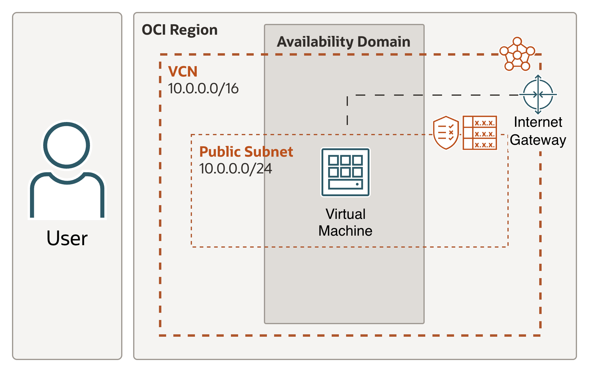

# OpenClaw on OCI via Resource Manager
This Resource Manager stack launches an OCI compute instance for OpenClaw, discovers which OCI Generative AI models are actually usable for the supplied API key through the OCI Responses API, and automatically configures OpenClaw to use those discovered models.

## Provisioned architecture

The following diagram shows the high-level architecture this stack provisions.

<p align="center">
  
</p>

## Required OCI IAM Policy for the Generative AI API Key

Before deploying this stack:

1. Create an OCI Generative AI API key.
2. Copy the API key **value**.
3. Copy the API key **OCID**.
4. Create an IAM policy that allows that API key to use OCI Generative AI.
5. Use the API key **value** in the `oci_genai_api_key` stack variable when launching this stack.

Example IAM policy:

```text
allow any-user to use generative-ai-family in tenancy where ALL {request.principal.type='generativeaiapikey', request.principal.id='<your-generative-ai-api-key-ocid>'}
```

Notes:
- The **API key value** is what you paste into the Resource Manager stack variable.
- The **API key OCID** is what you use in the IAM policy condition.

## Quick Deploy to OCI

Launch this stack directly in OCI Resource Manager.

<p align="center">
  <a href="https://cloud.oracle.com/resourcemanager/stacks/create?zipUrl=https%3A%2F%2Fgithub.com%2FPhirlly%2FOCIOraClaw%2Farchive%2Frefs%2Fheads%2Fmain.zip">
    
  </a>
</p>

After the stack opens in OCI Resource Manager, provide the required deployment inputs such as compartment, availability domain, image, SSH public key, and OCI Generative AI API key.

The stack implements an end-to-end automated flow that:
- provisions the VM and required network resources
- installs OpenClaw automatically
- discovers usable OCI Responses API models at instance startup
- binds those discovered models into OpenClaw as a custom `oci` provider
- configures OpenClaw to use the OCI OpenAI-compatible **Responses API** path
- installs and starts the OpenClaw gateway automatically

## Runtime behavior

At first boot, the instance performs these phases:

1. Install discovery assets and systemd unit.
2. Create the OpenClaw runtime/config home under `/home/opc/.openclaw`.
3. Wait for DNS resolution and outbound HTTPS readiness before network-dependent bootstrap steps begin.
4. Refresh package metadata and install bootstrap dependencies with bounded retries.
5. Download and run the OpenClaw installer only after the installer endpoint is reachable.
6. Verify that the OpenClaw binary exists before running configuration commands.
7. Create a guarded system-wide symlink at `/usr/local/bin/openclaw` after verifying the installed binary path.
8. Configure OpenClaw gateway basics:
   - `gateway.mode = local`
   - `gateway.bind = loopback`
   - `gateway.auth.mode = token`
9. Start the OCI model discovery systemd unit.
10. Wait for discovery output to exist.
11. Create a custom OpenClaw provider named `oci`.
12. Configure the discovered OCI models into OpenClaw.
13. Set the default OpenClaw model to the first discovered usable OCI model.
14. Install and start the OpenClaw gateway service.

## How OCI model discovery currently works

The current model discovery process is intentionally dynamic.
It is implemented so that users can supply an OCI Generative AI API key associated with any currently supported region in OCI, and the stack will keep only the regions and models that actually respond as usable through the OCI Responses API for that key.

### Supported discovery regions

The stack currently probes these OCI regions:

- `eu-frankfurt-1`
- `ap-hyderabad-1`
- `ap-osaka-1`
- `us-ashburn-1`
- `us-chicago-1`
- `us-phoenix-1`

### How probing works

The discovery process uses the candidate catalog in:

```text
/opt/openclaw/discovery/01-oci-genai-chat-candidates.json
```

At startup, the discovery script:

1. Iterates through each supported region.
2. Builds the OCI Responses API endpoint for that region.
3. Selects the first configured candidate model for that region as the probe model.
4. Sends a minimal request to the region’s `responses` endpoint using:
   - the candidate model ID
   - `input: "Reply with exactly the word OK"`
5. Classifies the result.

### What happens after the probe

If the first probe for a region returns one of the following classifications:
- `usable`
- `invalid_model_id`
- `bad_request`
- `rate_limited`

then the script continues testing all configured candidate models for that region and keeps only the ones that are actually usable.

If the first probe returns one of the following classifications:
- `auth_failed`
- `forbidden`
- `transport_error`
- `other`

then the script does **not** enumerate all models in that region, because the region is treated as unavailable or not usable for the supplied key in its current state.

### What users should expect

This means:
- the same API key may succeed in one supported region and fail in another
- region-level `401` or `403` diagnostics are not automatically a full deployment failure
- the deployment is considered successful as long as discovery finds at least one usable region with at least one usable model
- only the discovered usable region/model set is written into the resulting OpenClaw provider config
- the stack currently applies only the **first usable region** returned by discovery

## Important: wait for cloud-init to finish before running OpenClaw commands

Do not run `openclaw` commands immediately after the VM becomes reachable.
Wait until first-boot bootstrap has fully completed.

Run this command on the VM:

```bash
sudo cloud-init status --long || true
```

### What users see while bootstrap is still running

Example output while the instance is still provisioning OpenClaw and discovery assets:

```text
[opc@openclaw ~]$ sudo cloud-init status --long || true
status: running
extended_status: running
boot_status_code: enabled-by-generator
last_update: Thu, 01 Jan 1970 00:00:31 +0000
detail: DataSourceOracle
errors: []
recoverable_errors: {}
```

If the output shows `status: running`, wait and run the command again in a minute.

### What users see when bootstrap is complete

Example output after bootstrap has finished successfully:

```text
[opc@openclaw ~]$ sudo cloud-init status --long || true
status: done
extended_status: done
boot_status_code: enabled-by-generator
last_update: Thu, 01 Jan 1970 00:06:45 +0000
detail: DataSourceOracle
errors: []
recoverable_errors: {}
[opc@openclaw ~]$
```

Only after the output shows `status: done` should users proceed with `openclaw` commands.

For instances provisioned from this updated stack, `openclaw` should then be directly available from the shell:

```bash
openclaw --version
```

If your SSH session was opened before bootstrap finished and the command is still not found, exit and SSH back in once, then retry:

```bash
openclaw --version
```

## Get the current gateway token in the terminal

After `cloud-init` is complete, print the current OpenClaw gateway token with:

```bash
sudo -u opc bash -lc 'python3 -c "import json; print(json.load(open(\"/home/opc/.openclaw/openclaw.json\"))[\"gateway\"][\"auth\"][\"token\"])"'
```

This prints the token currently configured in `/home/opc/.openclaw/openclaw.json`.

## Accessing the OpenClaw UI

The OpenClaw gateway is intentionally configured as loopback-only:

- bind: `127.0.0.1`
- port: `18789`

That means the Control UI is not directly exposed on the VM public IP.

Use an SSH local port forward from your local machine:

```bash
ssh -i /ABSOLUTE/PATH/TO/YOUR/PRIVATE_KEY -L 18789:127.0.0.1:18789 opc@<INSTANCE_PUBLIC_IP>
```

Then open locally in your browser:

```text
http://127.0.0.1:18789/
```

When prompted, paste the token printed from the terminal.

Because the gateway is configured with:
- `bind = loopback`
- `auth.mode = token`

you must both:
- access it through the SSH local port forward, and
- provide the current gateway token to log in.

## Optional post-deploy verification

Use the following commands only if you want to validate the deployment in more detail or troubleshoot an issue.
These commands are not required just to sign in and use OpenClaw.

```bash
sudo cloud-init status --long || true
sudo tail -n 250 /var/log/cloud-init-output.log
sudo systemctl status openclaw-model-discovery.service --no-pager
sudo cat /opt/openclaw/runtime/03-oci-genai-chat-models.json
sudo -u opc bash -lc 'cat /home/opc/.openclaw/openclaw.json'
sudo -u opc bash -lc 'export PATH="/home/opc/.npm-global/bin:$PATH"; export XDG_RUNTIME_DIR="/run/user/$(id -u)"; openclaw gateway status'
sudo -u opc bash -lc 'export PATH="/home/opc/.npm-global/bin:$PATH"; export XDG_RUNTIME_DIR="/run/user/$(id -u)"; openclaw health --verbose'
```

Expected outcomes:
- cloud-init completes successfully
- discovery service succeeds
- discovery output contains usable OCI models
- `openclaw.json` contains the `oci` provider binding and discovered models
- OpenClaw gateway is installed, running, and healthy

## Notes on bootstrap behavior

The bootstrap has been hardened to improve reliability on first boot.
In some environments, the OpenClaw installer may need more than one attempt before the binary becomes available.
The current bootstrap flow retries the installer and only continues once the OpenClaw binary is present.

The bootstrap also creates a guarded symlink at `/usr/local/bin/openclaw` after verifying the installed binary path. This is intended to make the command available more consistently for operators without depending solely on shell startup files.

If `/usr/local/bin/openclaw` already exists and does not point to `/home/opc/.npm-global/bin/openclaw`, bootstrap stops instead of overwriting it.

You may also see non-fatal installer output such as non-interactive `/dev/tty` warnings during bootstrap.
If `cloud-init` finishes with:
- `status: done`
- `errors: []`

and the gateway plus discovery checks succeed, those warnings can be treated as informational rather than deployment failure.

## Current limitations / next hardening steps

The stack is now functionally working end-to-end, but later improvements may still include:

- stronger secret handling beyond direct API-key rendering into cloud-init and `~/.openclaw/.env`
- optional further refinement of model discovery heuristics and exclusions
- optional exposure improvements (for example Tailscale or reverse proxy / LB patterns) instead of SSH local forwarding
- optional networking/security hardening after bootstrap validation.